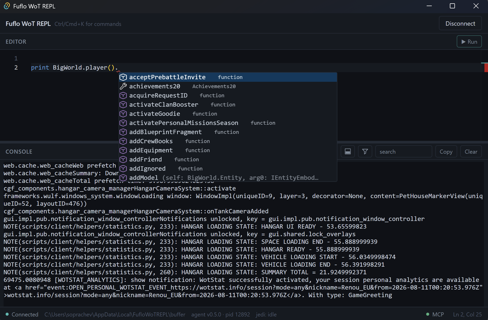

### | [EN](./README.md) | RU |

# Fuflo WoT REPL

Десктопное приложение для разработки модов **World of Tanks** и **«Мир танков»**. Оно подключается к запущенному клиенту, выполняет Python 2.7-код в игровом потоке и показывает вывод в реальном времени.



## Возможности

- Поддержка и **World of Tanks** и **«Мир танков»**
- Выполнение Python-кода в живом клиенте.
- Потоковый вывод `stdout`, `stderr` и сообщений `BigWorld.log*` во встроенную консоль.
- Поиск по логам и фильтрация по уровню `log level`.
- Автодополнение по реальным объектам клиента с их сигнатурами.
- Запуск клиента/реплея или подключение к уже существующей запушенной игре.
- Автоматической поиск и запоминание добавленных клиентов.
- Встроенный MCP-сервер, чтобы управлять клиентом из ИИ-агентов.

## Установка

[Скачайте](https://github.com/Newmcpe/fuflo-wot-repl/releases/latest) установщик актуальной версии из релизов на GitHub и установите.

## Использование

1. Запустите приложение. Оно найдёт типичные установки игры автоматически; если нужной нет в списке, нажмите **Browse…** и укажите корень клиента.
2. Выберите клиент и нажмите **Launch Game**. Для запуска реплея используйте стрелку рядом с этой кнопкой и выберите `.wotreplay` или `.mtreplay`.
3. Приложение установит агент в папку `mods/<версия>` выбранного клиента, запустит игру и дождётся статуса **Connected**. Если игра уже запущена и агент был установлен ранее, нажмите **Connect**.
4. Введите код в редакторе и нажмите `Ctrl/Cmd+Enter`: будет выполнен выделенный код, а если выделения нет — весь редактор. Результат и журналы появятся в консоли справа.

После подключения приложение автоматически исследует доступные типы клиента и сохраняет сгенерированные заглушки в `%LOCALAPPDATA%\FufloWoTREPL\stubs`. Статический анализ исходников игры выполняет отдельный Jedi-воркер на Python 2.7; его протокол и настройка описаны в [`tools/jedi_worker/README.md`](tools/jedi_worker/README.md).

## MCP

При первом запуске приложение создаёт и по умолчанию включает локальный Streamable HTTP MCP-сервер. Он слушает `0.0.0.0:8765`; постоянный локальный адрес имеет вид:

```text
http://127.0.0.1:8765/mcp?token=<постоянный-UUID>
```

Токен и состояние сервера хранятся в `%LOCALAPPDATA%\FufloWoTREPL\mcp.json`. Нажмите **MCP** в строке состояния, чтобы включить или выключить сервер, скопировать локальный либо сетевой URL, а также добавить конфигурацию `wot_repl` в Codex или Claude Code. Для кнопок добавления соответствующий CLI должен быть доступен в `PATH`.

Вручную добавить сервер в Codex можно так:

```sh
codex mcp add wot_repl --url "http://127.0.0.1:8765/mcp?token=<токен>"
```

Сервер предоставляет шесть инструментов:

| Инструмент         | Назначение                                                                                                    |
| ------------------ | ------------------------------------------------------------------------------------------------------------- |
| `wot_list_clients` | Найти поддерживаемые установки игры и показать их состояние.                                                  |
| `wot_start_client` | Установить/подключить агент и запустить клиент; принимает `game_dir` и необязательный `replay_path`.          |
| `wot_close_client` | Корректно закрыть активный клиент; необязательный `timeout_ms` ограничен диапазоном 0–60000.                  |
| `wot_kill_client`  | Принудительно завершить активный клиент после проверки процесса.                                              |
| `wot_exec`         | Выполнить Python 2.7-код в главном потоке игры; принимает `code` и необязательный `timeout_ms` от 1 до 30000. |
| `wot_read_log`     | Прочитать свежие сообщения лога; поддерживает `cursor`, `limit` и короткое ожидание через `wait_ms`.          |

`wot_exec` способен менять состояние игры, а `wot_close_client` и `wot_kill_client` завершают процесс. Начинайте работу MCP-клиента с `wot_list_clients` и используйте `wot_close_client` прежде, чем прибегать к принудительному завершению.

## Архитектура и разработка

- [`docs/ARCHITECTURE.md`](docs/ARCHITECTURE.md) — состав приложения и взаимодействие компонентов.
- [`docs/PROTOCOL.md`](docs/PROTOCOL.md) — файловый протокол обмена между приложением и игровым агентом.
- [`docs/PLAN.md`](docs/PLAN.md) — исходный план и границы проекта.

Основной код находится в `src/` (React/TypeScript, Feature-Sliced Design), `src-tauri/` (Tauri/Rust) и `mod/` (агент Python 2.7 и его тесты).
